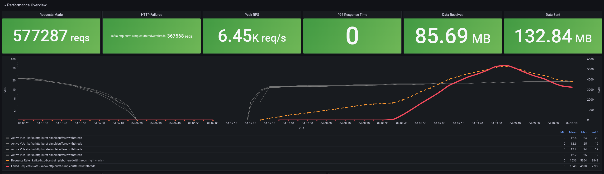
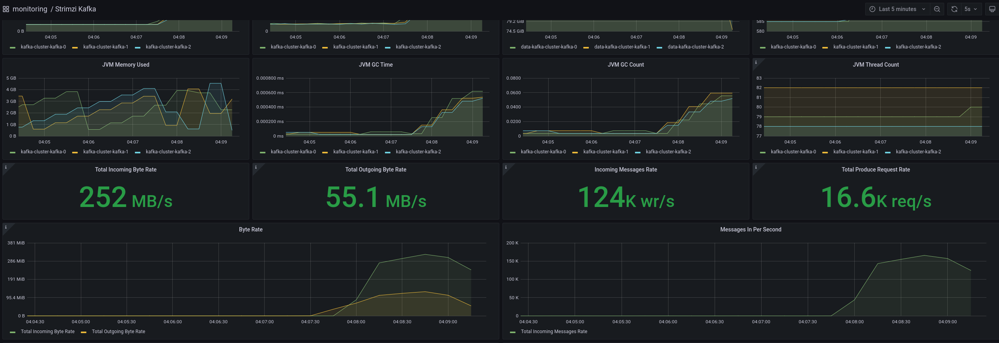
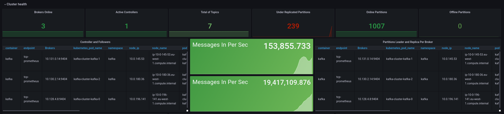

# Performance Bencher

In this repository, you will find the essential resources to test multiple languages on some of the most common tasks in modern development processes. These tasks include responding to HTTP servers, making HTTP requests, communicating over REST APIs or gRPC calls, producing and consuming Kafka messages, and saving and retrieving data from PostgreSQL, among other common tasks.

<p align="center">
  
</p>

## Load Tests

Load tests are an essential practice in software development as they allow evaluating the performance and capacity of a system under high-demand conditions. This type of testing simulates situations where many users are interacting simultaneously with the system, performing various operations such as sending requests, processing data, and accessing resources.

The goal of load testing is to identify potential bottlenecks and limitations of the system, ensuring that it can handle the expected load and maintain acceptable performance. During the test, important metrics are collected and analyzed, including response time, throughput, resource utilization, and scalability.

The purpose of this repository is to provide developers with a practical and hands-on approach to testing various programming languages in different scenarios. By exploring the code and examples provided, you can gain a better understanding of how different languages handle these tasks and make informed decisions when selecting the most suitable language for your specific project requirements.

Feel free to explore the repository and leverage the resources available to enhance your knowledge and skills in multi-language development. The goal is to empower developers to choose the right language for the job and build robust and efficient applications in diverse environments.

## Complete List of Repo capabilities

Bellow, you will find a comprehensive list of the capabilities provided by this repository:

### To environment setup

|                       | Openshift | Kubernetes  |  Monitoring |
|-----------------------|-----------|-------------|-------------|
|Kafka                  |     X     |      -      |      X      |
|Postgres               |     X     |      -      |      -      |
|Monitoring Tool        |     X     |      -      |      X      |
|DataScience Analysis   |     X     |      -      |      -      |
|K6 load test           |     X     |      -      |      X      |

### Language capabilities

|           | HTTP | GRPC | COMPLEX HTTP | KAFKA | DATABASE|
|-----------|------|------|--------------|-------|---------|
|   Quarkus |X     |-     |-             |X      |-        |
|   Golang  |-     |-     |-             |-      |-        |
|   Rust    |-     |-     |-             |-      |-        |
|   NodeJS  |-     |-     |-             |-      |-        |

## Make the environment setup

All the environment to test can be setup with a block of commands:

PS. Make sure that you are logged on your cluster before any of the following commands

```bash
cd benchmarks/env-setup
sh deploy.sh
```

to a clean install on openshift use:

```bash
cd benchmarks/env-setup
sh deploy-openshift.sh
```

to a clean install on kubernetes use:

```bash
cd benchmarks/env-setup
sh deploy-kubernetes.sh
```

Is also possible to make the installation of each component by itself, this is possible given
that each one of them has a deploy.sh file inside it, so to make a installation of a specific component
go to its folder an run the follow command:

```bash
sh deploy.sh
```

### Grafana Dashboards

The installation will make available some grafana dashboard, they will allow for a better understand of the results,
and also for insights about possible optimizations.

The follow dashboards will be available on the default installation:

#### K6 Dashboard



#### Kafka dashboards




#### Grafana credentials

To get the credential of your grafana, just run the follow command:

```bash
oc project monitoring
oc get secret grafa
```

## Deploy Applications

Now we will deploy the applications that will run the load. Each of this applications can be deployed in its own way, the detailed explanation of each one could be found on the its respective READ-ME file. 
Deploy the producer:

* [Quarkus Application](quarkus/README.md)
* [Quarkus Batch Application](quarkus/README.md)

## K6 tests

K6 is an open-source load testing tool designed for developers and focused on simplicity and scalability. It allows you to write and execute load tests using JavaScript, making it easy to define complex scenarios and simulate realistic user behavior. With K6, you can generate high levels of concurrent virtual users to stress test your system and measure its performance under different load conditions. It provides detailed metrics and real-time results, enabling you to identify bottlenecks, measure response times, and assess the scalability and stability of your application. K6's scripting capabilities, extensibility, and integration with other tools make it a popular choice for load testing in agile development and continuous integration workflows.

To run tests using K6 in OCP, do you need install the following programs in your computer:

* Go
* Kustomize
* Kubectl
* Make

The installation process could be done in two ways:

### Scripted

The first and easy way is to use the script available in this repo, that will make the complete k6 installation on your cluster. The script on the folder
[k6 env setup](benchmarks/env-setup/k6/deploy.sh), to run it just use the follow command:

```bash
cd benchmarks/env-setup/k6/
sh deploy.sh
```

is also possible to pass some parameters to the script, to make the process faster.

```bash
cd benchmarks/env-setup/k6/
sh deploy.sh openshift clean
```

### Step by Step

By choosing this option, is possible to customize the installation process, as wee to fine tuning the deploy for your needs.

The first step is to clone the K6 Operator repository with this commands:

```bash
git clone https://github.com/grafana/k6-operator && cd k6-operator
```

To deploy K6 Operator, you need run the following command:

```bash
make deploy
```

Now, we back to this repository folder and go create a configmap with our K6 test plan:

```bash
oc project k6-operator-system
cd k6
oc create configmap k6-api-test --from-file kafka-load-tests.js
```

Finally, we do create a k6 instance with this command:

```bash
oc apply -f k6-sample.yaml
```

You can follow the Test run with command "oc get pods" and observe, in this case 4 pods simultaneously running tests like bellow:


Make the adjustments the test case for what your need and enjoy!

## Conclusions

Despite using simpler approaches and spending a lot of time deploying metrics tools for load testing, this approach allows us to tune our environment as we execute the tests. We can adjust the number of users to a scenario that truly makes sense for the application, thus obtaining more accuracy in tuning the environment.
